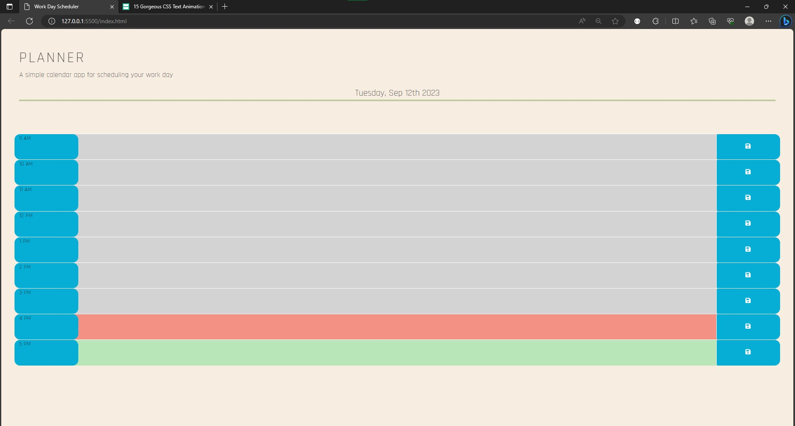

# Daily-Planner

## This application is a simple little daily planner where you can log and plan your activities for the day that you intend to get done like appointments, errands, homework, etc.. This week provided a slight challenge to me considering I had issues in the past using local storage to display items, but I think I am getting the hang of it! I always love challenging myself and striving to be better.

## Once you've opened the application through the provided link below, you will see the layout is very straightforward. It is a simple 9AM-5PM schedule where, if you were to click in the gray area next to your chosen hour, you can type in it. Upon hitting save, this information is saved into the local storage and, if you are to refresh the page, the information is pulled from local storage and remains in the box.

## To access this application, you can click the link provided() or gain access to it through my github.

## Through my research, I found a lot of useful bits here and there. Some from StackOverflow and w3schools. Below, I provided a link that provides the fun animation effect I was able to add to my header.

- https://alvarotrigo.com/blog/css-text-animations/

Copyright 2023 ConquerersHaki Permission is hereby granted, free of charge, to any person obtaining a copy of this software and associated documentation files (the “Software”), to deal in the Software without restriction, including without limitation the rights to use, copy, modify, merge, publish, distribute, sublicense, and/or sell copies of the Software, and to permitpersons to whom the Software is furnished to do so, subject to the following conditions:The above copyright notice and this permission notice shall be included in all copies or substantial portions of the Software.THE SOFTWARE IS PROVIDED “AS IS”, WITHOUT WARRANTY OFANY KIND, EXPRESS OR IMPLIED, INCLUDING BUT NOT LIMITEDTO THE WARRANTIES OF MERCHANTABILITY, FITNESS FOR A PARTICULAR PURPOSE AND NONINFRINGEMENT. IN NO EVENTSHALL THE AUTHORS OR COPYRIGHT HOLDERS BE LIABLE FOR ANY CLAIM, DAMAGES OR OTHER LIABILITY, WHETHER IN AN ACTION OF CONTRACT, TORT OR OTHERWISE, ARISING FROM, OUT OF OR IN CONNECTION WITH THE SOFTWARE OR THE USE OR OTHER DEALINGS IN THE SOFTWARE.
